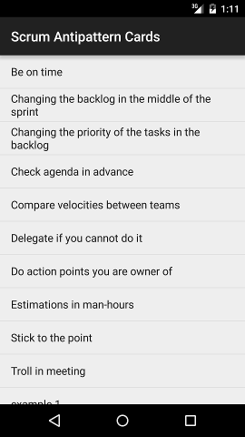
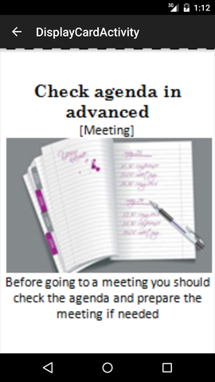
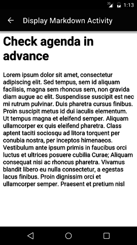
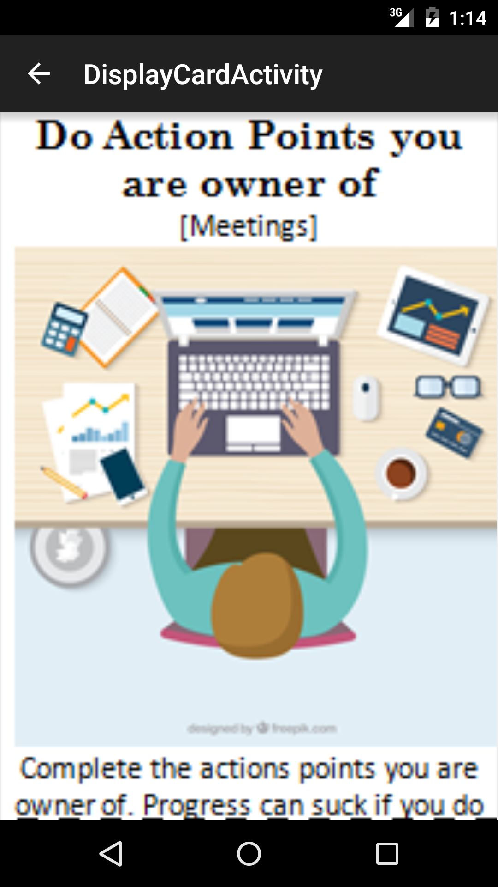
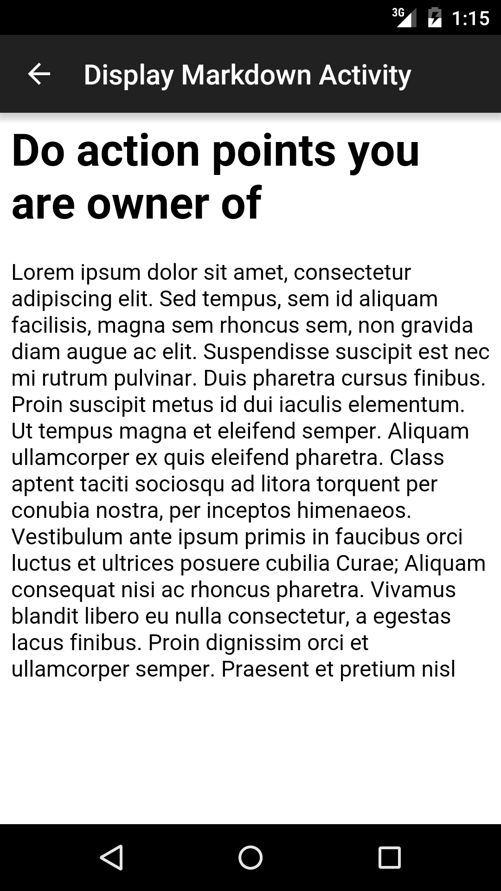

# Scrum Antipattern Cards
**Disclaimer:** Scrum Antipattern Cards is still a PoC (Proof of Concept).

## Why?
Have you ever been following Scrum and hitting now and then the same mistakes?
They are recognizable patterns. They can be taught, but you have to be wary on how you say it.

## How?
Using funny pictures can be an easy way to show our mistakes and understand them.

## ScreenShots
Some screenshots of the app

### Main screen

### Check agenda in advance

### Do actions you are owner of

## Add your Cards
Adding new cards is pretty easy.
All cards are loaded as assets in image and markdown format.

## Credits
Pictures got from [www.freepik.com](www.freepik.com)
