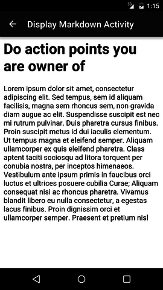

# Scrum Antipattern Cards
**Disclaimer:** Scrum Antipattern Cards is still a PoC (Proof of Concept).

## What is Scrum Antipattern Cards about?
Have you ever been following Scrum and hitting now and then the same mistakes?
They are recognizable patterns. They can be taught, but you have to be wary on how you say it.

## How it works?
Telling someone is doing something wrong can be harmful. If make her/him understand that missundertanding is a recurrent issue when people is learning Scrum and you show it in a funny way, instead of harmful in can be turn into something enjoyable and can help to build consistency.
Using funny pictures can be an easy way to show our mistakes and understand them.

## ScreenShots
Some screenshots of the app

### Main screen
This is the main screen you see in the app. All the element of this list are just cards showing common missundertanding in Scrum.

### Check agenda in advance
This is an example of a common issue. You go to a meeting and you have never check the agenda. Maybe you don't need to go the meeting or maybe you need to bring some material to show to others.

### Do actions you are owner of

## Add your Cards
Adding new cards is pretty easy.
All cards are loaded as assets in image and markdown format.

## Credits
Pictures got from [www.freepik.com](http://www.freepik.com)
